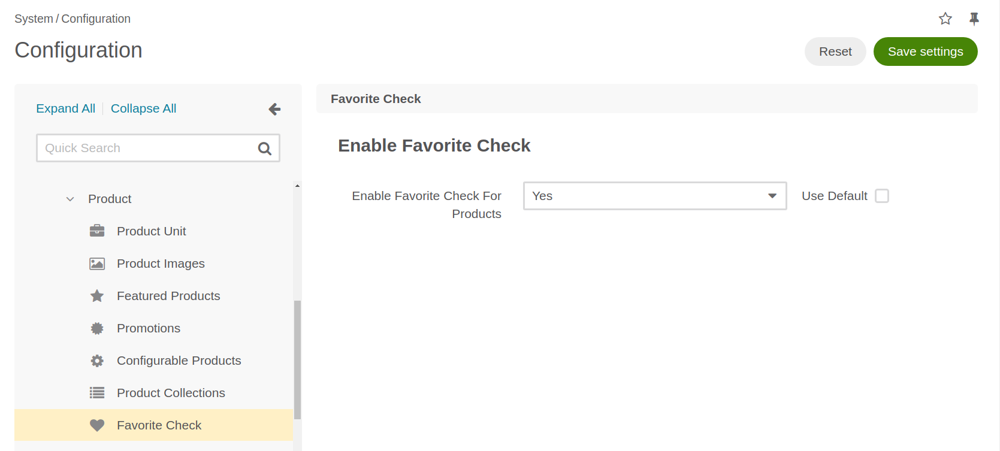

# Enable or Disable the Plugin in the BO

## Product Configuration
In the System/Configuration section under Commerce/Product you will find the "Favorite Check" option. By default the plugin will be activated.
You can deactivate it by changing the value from Yes to No.

