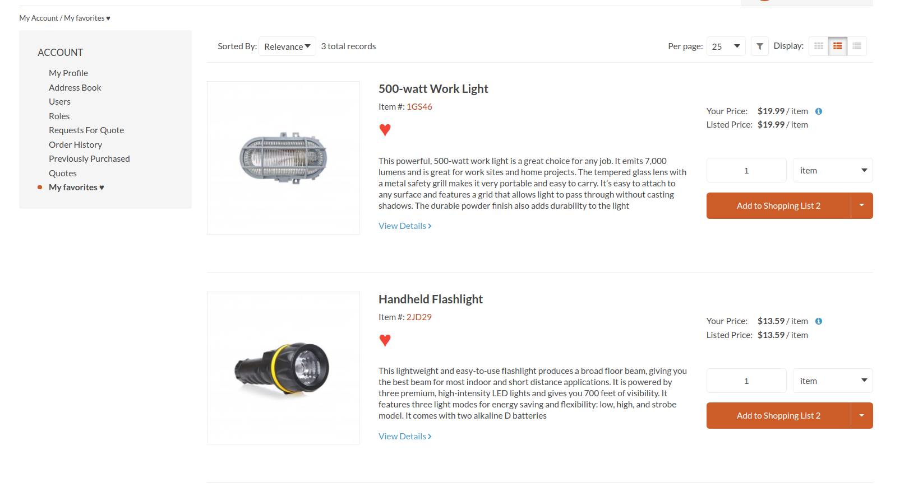
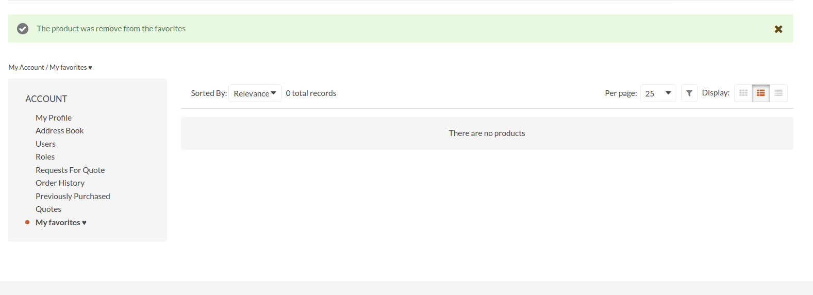
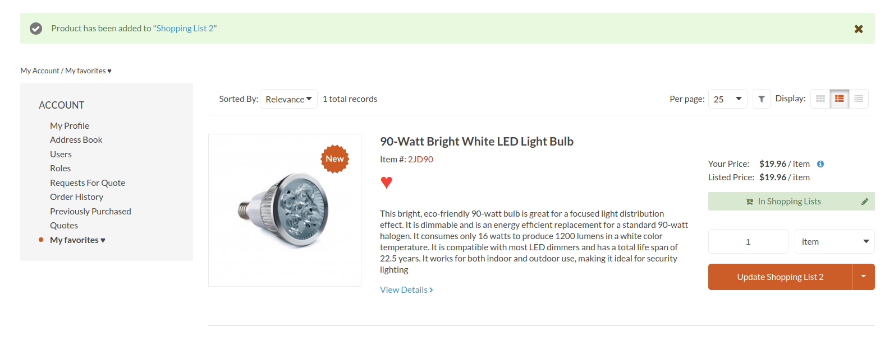

# Show the customer a list of their favorite products

## My favorites ♥ list
Within the customer's account, a section called My Favorites will appear. This will load a grid with the information of all the products marked as favorites.

## Remove product from my favorites
You can also remove products from your favorites and the list will be updated.

## Add a product in a shopping list
From the list of favorites, you can add your products to a shopping list.

