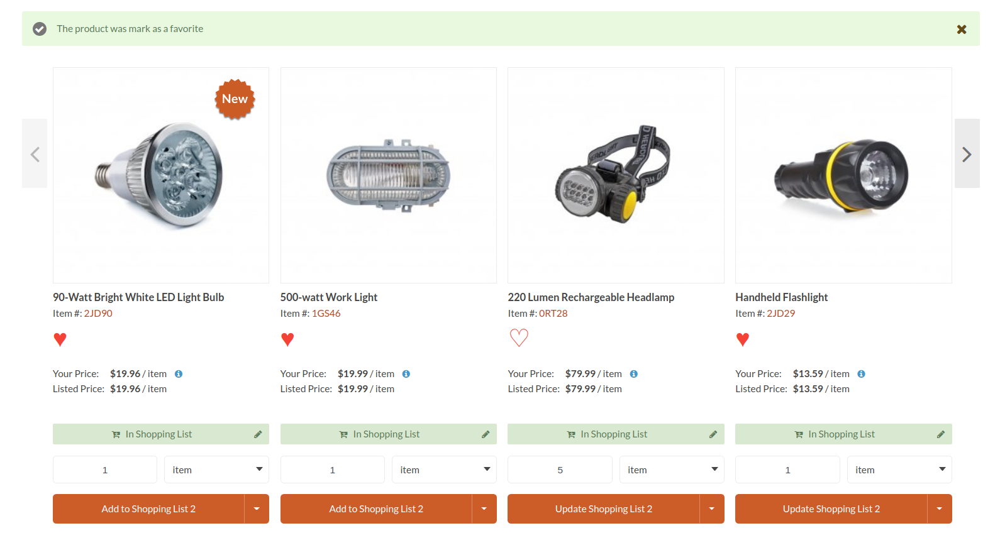
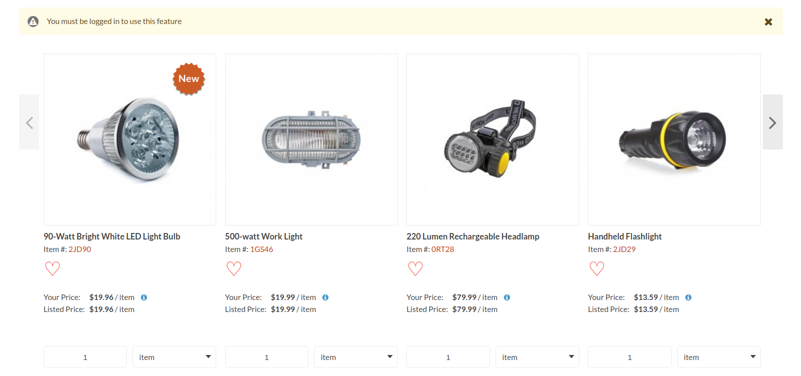

# Mark in red a heart when a product was marked as a favorite

## Action of marking a product as a favorite

When a customer is logged in and clicks on the heart icon of a product, the heart will turn from a white filled icon to a red filled one, indicating the product is now saved as favorite.
If the red button is clicked again, this product will be removed from the favorites list.

In addition, an alert message will appear indicating that the product was marked as a favorite or when it is removed.

## Mark a product as a favorite when a customer is not logged in

When a non-logged-in customer presses the favorites button, a message will appear indicating that this option is only available to logged-in users.

